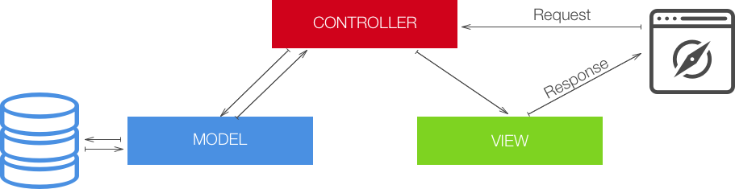

# mongoose

## The model-view-controller pattern

- Every time a `request` is made on the server, a `controller` handles it
- The controller uses `models` to read and write data to a database
- When the controller has all information, it can pass that data to the `view`, which generates a `response`



## Object document mapper

We will use an ODM as an abstraction on top of our database connection.  
The ODM translates the data from documents in our database to JavaScript objects.  

We will use mongoose. mongoose is an npm package for Node.js applications with MongoDB.

### Install mongoose

```
$ npm init -y
$ npm install mongoose
```
